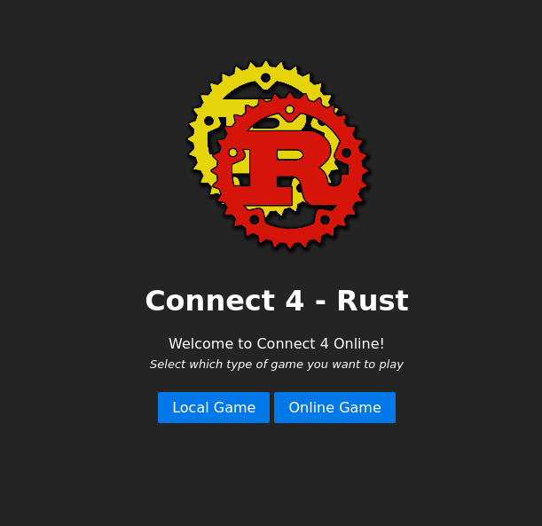
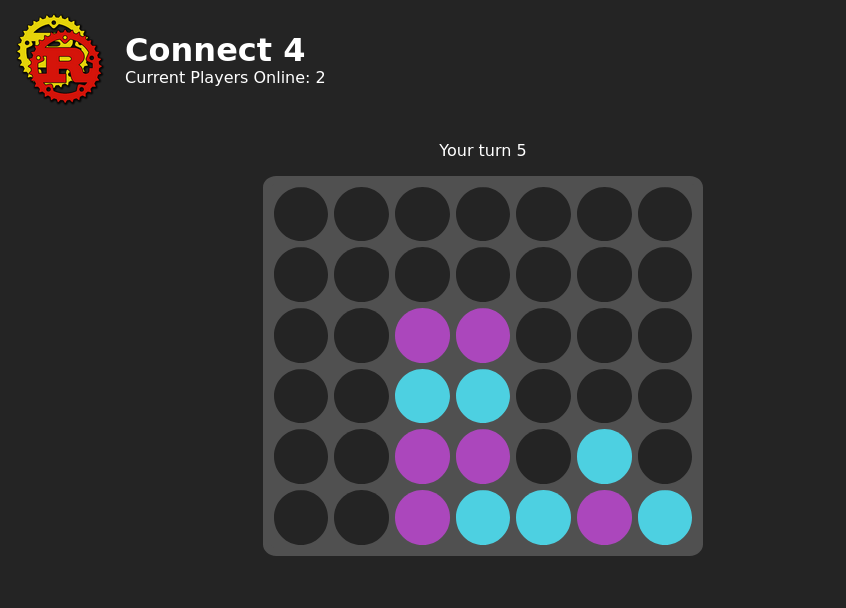

<!-- PROJECT LOGO -->
<br />
<p align="center">
  <a href="https://github.com/markuz449/Connect-4">
    
  </a>

  <h3 align="center">Connect 4</h3>

  <p align="center">
    The simple game of Connect 4 that can be played online by different players
  </p>
  <p align="center">
    <a href="https://marcusanderson.co.nz/connect-4">Play Here</a>
  </p>
</p>


<!-- TABLE OF CONTENTS -->
## Table of Contents

* [About the Project](#about-the-project)
  * [Built With](#built-with)
* [Getting Started](#getting-started)
  * [Prerequisites](#prerequisites)
  * [Installation](#installation)
* [Usage](#usage)
* [Roadmap](#roadmap)
* [Contributing](#contributing)
* [License](#license)
* [Contact](#contact)
* [Acknowledgements](#acknowledgements)


<!-- ABOUT THE PROJECT -->
## About The Project

This project is the Connect 4 game that can be plyed in browsers. You can play against another local player or you can play against someone online. I took the work that I did in the terminal version of the game as the basis for this version. 

This version is different because it uses Rust generated Web Assembly to run the game on the clients end. The game is hosted using Node.js Express server. The user input is handled by client side Javascript. If you are playing the online version of the game the user input is sent to the server using Socket.IO. The server then resents the users move to their opponent and both games on the users end update. There is no game being ran on the server.


### Built With

* [Rust](https://www.rust-lang.org/)
* [Web Assembly](https://webassembly.org/)
* [Rust and WebAssembly](https://github.com/rustwasm/)
* [Wasm-bindgen](https://github.com/rustwasm/wasm-bindgen)
* [Serde JSON](https://crates.io/crates/serde_json)
* [Node.js](https://nodejs.org/en/)
* [Winston](https://github.com/winstonjs)
* [Socket.IO](https://socket.io/)
* [Pure.CSS](https://purecss.io/)


<!-- GETTING STARTED -->
## Getting Started

To get a local copy up and running follow these simple steps.

### Prerequisites

* Node.js
```sh
sudo dnf install node
```
If you are not running a RPM-based linux distrabution follow the directions [here](https://nodejs.org/en/download) to install Node


### Installation
 
1. Clone the Connect-4 Repo
```sh
git clone https://github.com/markuz449/Connect-4.git
```
2. Go to the Online directory
```sh
cd Online
```
3. Install the necessary npm packages
```sh
npm install
```
4. Run the Node server
```sh
node server.js
```
5. Play the game on you browser
```sh
localhost:6969
```


<!-- USAGE EXAMPLES -->
## Usage

When you navigate to the server running the game you will see the homescreen. This is where you can decide if you want to play a local game or an online game. 

<p align="center">
  
  </img>
  
  </img>
</p>

The main code of the gameplay is hardcoded to be a 7 by 6 board. If you wanted to change the dimensions of the game you can edit the game.rs file. 

To recompile the Rust code to Wasm run:

```sh
wasm-pack build --target web
```
You will also need to change the game.html and game.js files to represent how many columns and rows your new game will have. 


<!-- ROADMAP -->
## Roadmap

See the [open issues](https://github.com/markuz449/Connect-4/issues) for a list of proposed features (and known issues).


<!-- CONTRIBUTING -->
## Contributing

Contributions are what make the open source community such an amazing place to be learn, inspire, and create. Any contributions you make are **greatly appreciated**.

1. Fork the Project
2. Create your Feature Branch (`git checkout -b feature/AmazingFeature`)
3. Commit your Changes (`git commit -m 'Add some AmazingFeature'`)
4. Push to the Branch (`git push origin feature/AmazingFeature`)
5. Open a Pull Request


<!-- LICENSE -->
## License

Distributed under the GNU General Public License v3.0 License. See `LICENSE` for more information.


<!-- CONTACT -->
## Contact

Marcus Anderson - markuz449@gmail.com

Project Link: [https://github.com/markuz449/Connect-4](https://github.com/markuz449/Connect-4)


<!-- ACKNOWLEDGEMENTS -->
## Acknowledgements

* [Rust Docs](https://doc.rust-lang.org/book/ch00-00-introduction.html)
* [Choose an Open Source License](https://choosealicense.com)
* [Rust Wasm Docs](https://wasmbyexample.dev/examples/hello-world/hello-world.rust.en-us.html?fbclid=IwAR23IOJpRYOf-N5wXLzcQJfniSsvZamUw113Fdv9UszUv-jdHgal7IiQfPg)
* [Serde Docs](https://serde.rs/)
* [Socket.IO tutorial](https://medium.com/@noufel.gouirhate/build-a-simple-chat-app-with-node-js-and-socket-io-ea716c093088)
* [Pure Grids](https://purecss.io/grids/)
* [Flexbox Guide](https://css-tricks.com/snippets/css/a-guide-to-flexbox/)
