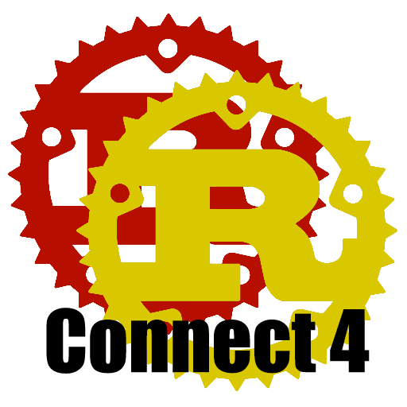

<!-- PROJECT LOGO -->
 

  

  <h3 align="center">Connect 4</h3>

  

    This is Connect 4 built using the Rust language.
  

<!-- TABLE OF CONTENTS -->
## Table of Contents

* [About the Project](#about-the-project)
  * [Built With](#built-with)
* [Roadmap](#roadmap)
* [Contributing](#contributing)
* [License](#license)
* [Contact](#contact)

<!-- ABOUT THE PROJECT -->
## About The Project

This project is the simple game of connect 4. I wanted to learn a new language and thought this would be a great project to do. The entire project has been built from the ground up and has two different versions, one which works on terminal the other is an online version.

### Built With

* [Rust](https://www.rust-lang.org/)

<!-- ROADMAP -->
## Roadmap

See the [open issues](https://github.com/markuz449/Connect-4/issues) for a list of proposed features (and known issues).

<!-- CONTRIBUTING -->
## Contributing

Contributions are what make the open source community such an amazing place to be learn, inspire, and create. Any contributions you make are **greatly appreciated**.

1. Fork the Project
2. Create your Feature Branch (`git checkout -b feature/AmazingFeature`)
3. Commit your Changes (`git commit -m 'Add some AmazingFeature'`)
4. Push to the Branch (`git push origin feature/AmazingFeature`)
5. Open a Pull Request

<!-- LICENSE -->
## License

Distributed under the GNU General Public License v3.0 License. See `LICENSE` for more information.

<!-- CONTACT -->
## Contact

Marcus Anderson - markuz449@gmail.com

Project Link: [https://github.com/markuz449/Connect-4](https://github.com/markuz449/Connect-4)
