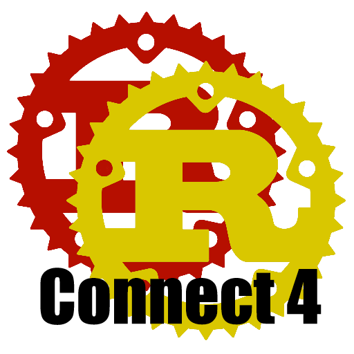
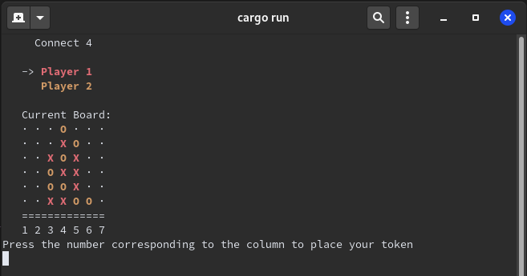
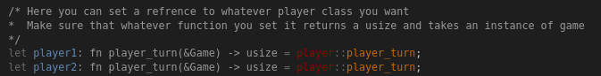

<!-- PROJECT LOGO -->
<br />
<p align="center">
  <a href="https://github.com/markuz449/Connect-4">
    
  </a>

  <h3 align="center">Connect 4</h3>

  <p align="center">
    This is a simple terminal game of Connect 4.
  </p>
</p>


<!-- TABLE OF CONTENTS -->
## Table of Contents

* [About the Project](#about-the-project)
  * [Built With](#built-with)
* [Getting Started](#getting-started)
  * [Prerequisites](#prerequisites)
  * [Installation](#installation)
* [Usage](#usage)
* [Roadmap](#roadmap)
* [Contributing](#contributing)
* [License](#license)
* [Contact](#contact)
* [Acknowledgements](#acknowledgements)


<!-- ABOUT THE PROJECT -->
## About The Project

This project is the game Connect 4. It runs in the terminal and can currently only be played with two people. This was the start of my Rust Connect 4 project which got me familiar with the language and how the game should be ran. I later then took the base of the game and turned it into an online version.


### Built With

* [Rust](https://www.rust-lang.org/)


<!-- GETTING STARTED -->
## Getting Started

To get a local copy up and running follow these simple steps.

### Prerequisites

* Rust
```sh
curl --proto '=https' --tlsv1.2 -sSf https://sh.rustup.rs | sh
```

### Installation
 
1. Clone the Connect-4
```sh
git clone https://github.com/markuz449/Connect-4.git
```
2. Build using Cargo
```sh
cargo build
```
2. Run using Cargo
```sh
cargo run
```


<!-- USAGE EXAMPLES -->
## Usage

This is a simple game that can be ran from the terminal and can be played by two different people. 

<p align="center">
  
  </img>
</p>

The player class is a simple interactive class which takes the user's move from terminal. I've added functionality to the program so that it could be ran to face off against an AI program so you could have a solo player experience. 

To change to a different player you need to change the refrence to the player which can be done in game.rs

<p align="center">
  
  </img>
</p>

You need to ensure that whatever function that you changee to it takes in the game state as an input and returns a usize which maps to the players move.

You can generate documentation for this project using cargo

1. Generate docs using cargo
```sh
cargo doc
```
2. Navigate to the docs
```sh
cd target/doc/Connect4
```
3. Open the documentation
```sh
xdg-open index.html
```


<!-- ROADMAP -->
## Roadmap

See the [open issues](https://github.com/markuz449/Connect-4/issues) for a list of proposed features (and known issues).


<!-- CONTRIBUTING -->
## Contributing

Contributions are what make the open source community such an amazing place to be learn, inspire, and create. Any contributions you make are **greatly appreciated**.

1. Fork the Project
2. Create your Feature Branch (`git checkout -b feature/AmazingFeature`)
3. Commit your Changes (`git commit -m 'Add some AmazingFeature'`)
4. Push to the Branch (`git push origin feature/AmazingFeature`)
5. Open a Pull Request


<!-- LICENSE -->
## License

Distributed under the GNU General Public License v3.0 License. See `LICENSE` for more information.


<!-- CONTACT -->
## Contact

Marcus Anderson - markuz449@gmail.com

Project Link: [https://github.com/markuz449/Connect-4](https://github.com/markuz449/Connect-4)


<!-- ACKNOWLEDGEMENTS -->
## Acknowledgements

* [Rust Docs](https://doc.rust-lang.org/book/ch00-00-introduction.html)
* [Choose an Open Source License](https://choosealicense.com)

